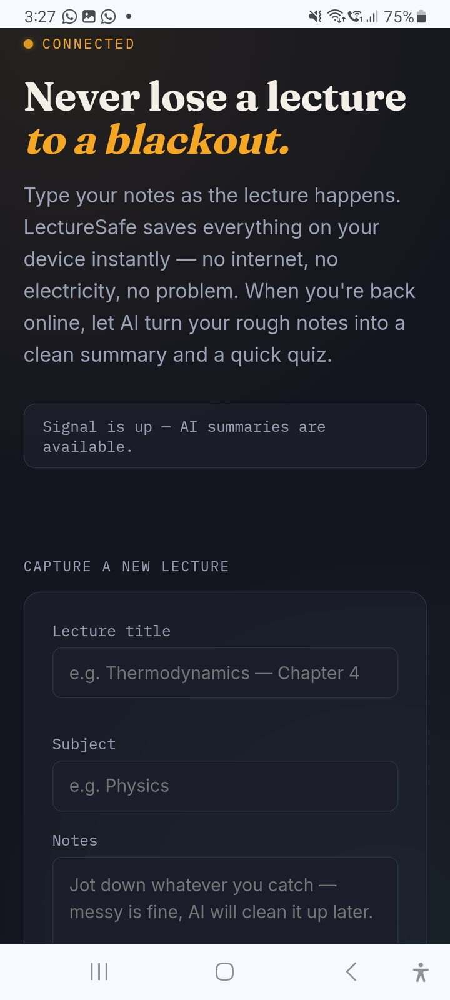
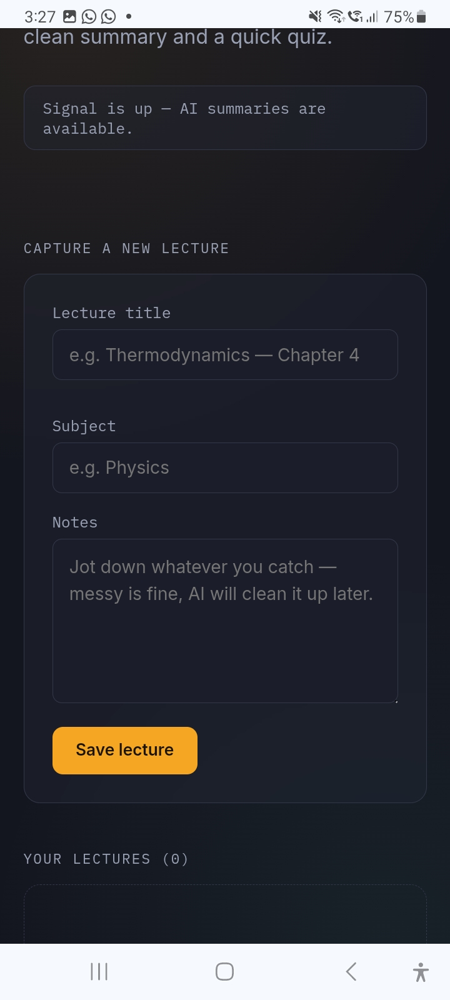
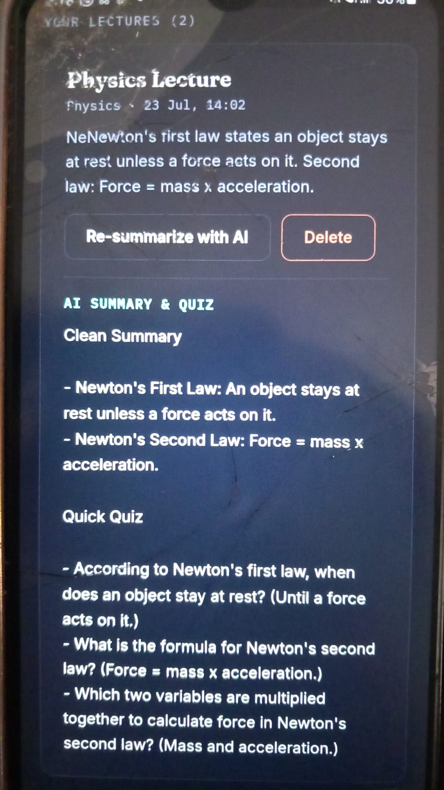

# LectureSafe 🕯️

**Never lose a lecture to a blackout.**

## a. What it does & the problem it solves

LectureSafe is a lecture-notes app built for students in places where electricity and internet are unreliable — a very common reality in Pakistan, where load shedding or a slow/dropped internet connection can hit in the middle of an important lecture and wipe out whatever wasn't saved yet.

**The problem:** During an online or in-person lecture, students type notes as they listen. If the power goes out or the internet drops, notes typed into most apps can be lost or become inaccessible right when it matters most.

**Who it's for:** University and college students who regularly deal with power cuts or unstable internet during study or class time.

**The solution:** LectureSafe saves every note directly on the student's device the instant they type it — no internet or server round-trip required to save. The app clearly shows whether it currently has a connection. Once the student is back online, they can tap one button to have AI turn their rough, in-the-moment notes into an organized summary and a short revision quiz.

## b. Live URL

🔗 **lecturesafe-xxmh.vercel.app**

## c. Features

- **Offline-first note capture** — add a lecture title, subject, and notes; everything is saved instantly to the browser's local storage, so it survives a lost connection or a page refresh.
- **Live connection indicator** — a status light in the header shows "connected" or "offline — writing by lamplight" in real time, based on the device's actual network status.
- **"Saved offline" badge** — any lecture captured while there was no connection is clearly marked.
- **AI-powered summarization** — turns rough, messy notes into a clean, organized summary with headings and bullet points, without inventing information that wasn't in the original notes.
- **AI-generated quick quiz** — automatically creates 3–5 short revision questions (with answers) based only on the actual lecture notes.
- **Lecture log** — a running list of every saved lecture, newest first, with subject and timestamp.
- **Delete lectures** — remove notes that are no longer needed.
- **Fully responsive** — usable on both mobile and desktop.

## d. The AI feature

**What it does:** When a student taps "Summarize with AI" on a saved lecture, the app sends that lecture's title, subject, and raw notes to Google's Gemini model through a secure server-side API route. Gemini returns a **Clean Summary** (organized with headings and bullets, preserving every fact/number/term from the original notes) and a **Quick Quiz** (3–5 short questions with answers) for revision — all generated only from what the student actually wrote, never invented.

**The exact system prompt used** (in `app/api/summarize/route.js`):
**Model used:** Google `gemini-flash-latest` via the Gemini API REST endpoint.

## e. Tools, services, and AI models used

- **Framework:** Next.js 14 (React) — App Router
- **Styling:** Custom CSS (no external UI framework)
- **Storage:** Browser `localStorage` for offline-first note persistence
- **AI model:** Google Gemini (`gemini-flash-latest`) via direct REST API calls from a server-side API route, so the API key is never exposed to the browser
- **Hosting/Deployment:** Vercel
- **Version control:** Git & GitHub
- **Built with the help of:** Claude (Anthropic) as a coding assistant

## f. Screenshots





## g. How to run the project

### Requirements
- Node.js 18 or newer
- A free Google Gemini API key ([aistudio.google.com/apikey](https://aistudio.google.com/apikey))

### Local setup

```bash
git clone https://github.com/YOUR-USERNAME/lecturesafe.git
cd lecturesafe
npm install
cp .env.example .env.local
# then open .env.local and add: GEMINI_API_KEY=your-real-key
npm run dev
```

Open [http://localhost:3000](http://localhost:3000) in your browser.

### Deploying to Vercel

1. Push this repo to your own public GitHub account.
2. Go to [vercel.com](https://vercel.com), sign in with GitHub, and import this repository.
3. In **Environment Variables**, add `GEMINI_API_KEY` with your real key.
4. Click **Deploy**.

⚠️ Never commit your real API key to GitHub — only `.env.example` (with a placeholder) is committed.

---

*Built as a final project — an app for students who study through blackouts and slow internet.*lecturesafe-xxmh.vercel.app
